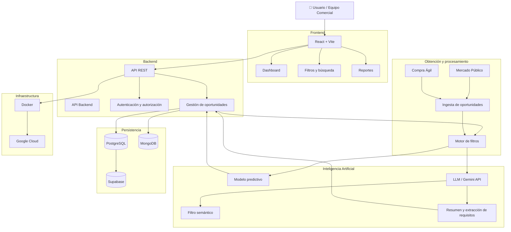
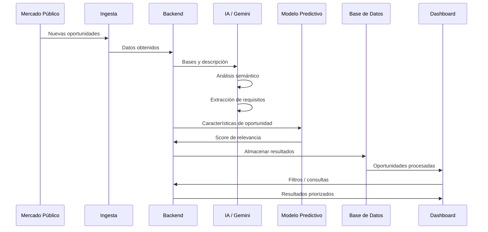
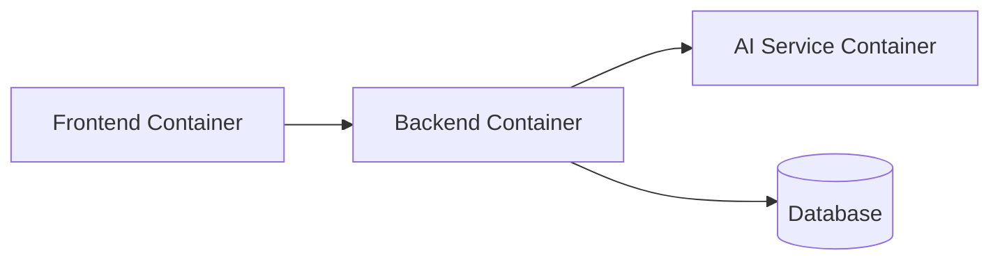

# LICING — Asistente Inteligente de Mercado Público

> Plataforma inteligente para la búsqueda, filtrado, análisis y priorización de oportunidades de **Mercado Público y Compra Ágil**, utilizando Inteligencia Artificial y modelos predictivos.

---

## 📌 Descripción

**LICING** es una plataforma orientada a automatizar parte del proceso de búsqueda y análisis de oportunidades comerciales disponibles en **Mercado Público y Compra Ágil**.

La solución está diseñada para reducir el trabajo manual del equipo comercial del **Hotel Plaza San Francisco**, permitiendo obtener oportunidades relevantes, analizarlas mediante Inteligencia Artificial y priorizarlas según criterios definidos por el negocio.

El sistema busca transformar un proceso actualmente manual y repetitivo en un flujo automatizado de:

**Obtención → Filtrado → Análisis → Priorización → Visualización → Decisión**

> ⚠️ LICING funciona como sistema de apoyo a la decisión. La decisión final de participar en una oportunidad permanece bajo responsabilidad del equipo comercial.

---

# 🎯 Objetivos

### Objetivo general

Reducir el tiempo dedicado a la búsqueda y revisión de oportunidades de Mercado Público, facilitando la identificación de aquellas con mayor relevancia para el hotel.

### Objetivos específicos

* Automatizar la obtención de oportunidades.
* Aplicar filtros según criterios definidos por el hotel.
* Identificar oportunidades potencialmente relevantes.
* Analizar bases de licitación mediante Inteligencia Artificial.
* Extraer requisitos y documentos obligatorios.
* Generar resúmenes ejecutivos.
* Priorizar oportunidades mediante un modelo predictivo.
* Centralizar la información en un dashboard.
* Facilitar la generación y descarga de reportes.

---

# 🏗️ Arquitectura

La arquitectura propuesta utiliza una separación por responsabilidades entre frontend, backend, procesamiento inteligente, persistencia e infraestructura.



---

## 🔄 Flujo de funcionamiento



---

# 🧩 Módulos principales

## 1. 🔎 Búsqueda y filtrado

Obtención automática de oportunidades desde Mercado Público y Compra Ágil.

Los resultados podrán filtrarse utilizando criterios como:

* Rubro.
* Monto.
* Ubicación.
* Fechas.
* Tipo de oportunidad.
* Palabras clave.
* Criterios específicos definidos por el hotel.

---

## 2. 🧠 Análisis inteligente

El sistema utilizará Inteligencia Artificial para analizar el contenido de las oportunidades y sus bases.

Entre las funcionalidades consideradas:

* Análisis semántico.
* Resumen automático.
* Identificación de requisitos.
* Extracción de documentos obligatorios.
* Identificación de información relevante.
* Clasificación de oportunidades.

El LLM será utilizado como componente de análisis, mientras que el modelo predictivo permitirá priorizar las oportunidades según su relevancia.

---

## 3. 📊 Gestión y Dashboard

El dashboard permitirá centralizar la información obtenida y procesada.

Se contempla:

* Visualización de oportunidades.
* Clasificación.
* Priorización.
* Seguimiento.
* Indicadores clave.
* Reportería.
* Exportación de resultados.

---

# 🧠 Inteligencia Artificial

LICING contempla dos componentes principales de IA:

### LLM

Responsable del análisis del lenguaje natural presente en las bases y descripciones de las oportunidades.

**Funciones previstas:**

```text
Base de licitación
       ↓
Análisis mediante LLM
       ↓
Resumen
       ↓
Requisitos
       ↓
Documentos obligatorios
       ↓
Información estructurada
```

### Modelo predictivo

El modelo predictivo tendrá como objetivo asignar una **prioridad o nivel de relevancia** a cada oportunidad.

```text
Oportunidad
     ↓
Características
     ↓
Modelo predictivo
     ↓
Score de relevancia
     ↓
Priorización
```

---

# 🧱 Tecnologías

> Las tecnologías indicadas como **tentativas** corresponden al stack actualmente considerado para el desarrollo y podrán modificarse durante las etapas de implementación.

| Capa                    | Tecnología            | Estado           |
| ----------------------- | --------------------- | ---------------- |
| Frontend                | React + Vite          | 🟡 Tentativa     |
| Backend                 | Django REST Framework | 🟡 Alternativa   |
| Backend                 | NestJS                | 🟡 Alternativa   |
| Lenguaje                | TypeScript            | 🟡 Según backend |
| IA / ML                 | Python                | 🟢 Considerada   |
| Procesamiento de datos  | Pandas                | 🟡 Tentativa     |
| Procesamiento de datos  | Polars                | 🟡 Tentativa     |
| LLM                     | Google Gemini API     | 🟡 Tentativa     |
| Base de datos           | PostgreSQL            | 🟡 Tentativa     |
| Base de datos           | MongoDB               | 🟡 Tentativa     |
| Plataforma Backend/Data | Supabase              | 🟡 Tentativa     |
| Contenedores            | Docker                | 🟡 Tentativa     |
| Cloud                   | Google Cloud          | 🟡 Tentativa     |
| Control de versiones    | Git + GitHub          | 🟢 Considerada   |

La selección de Django REST Framework o NestJS para backend aún se encuentra en evaluación, al igual que la combinación definitiva de PostgreSQL/MongoDB y la infraestructura cloud. El PPT presenta estas tecnologías como tentativas.

---

# 📁 Estructura propuesta del proyecto

```text
licing/
│
├── apps/
│   │
│   ├── frontend/
│   │   ├── src/
│   │   ├── components/
│   │   ├── pages/
│   │   ├── services/
│   │   └── hooks/
│   │
│   ├── backend/
│   │   ├── api/
│   │   ├── auth/
│   │   ├── opportunities/
│   │   ├── reports/
│   │   └── users/
│   │
│   └── ai-service/
│       ├── models/
│       ├── preprocessing/
│       ├── prediction/
│       └── llm/
│
├── libs/
│   ├── common/
│   └── schemas/
│
├── infrastructure/
│   ├── docker/
│   ├── cloud/
│   └── database/
│
├── docs/
│   ├── architecture.md
│   ├── diagrams/
│   ├── api/
│   └── brainstorming/
│
├── tests/
│   ├── unit/
│   ├── integration/
│   └── e2e/
│
├── .github/
│   └── workflows/
│       └── ci.yml
│
├── .env.example
├── docker-compose.yml
├── README.md
└── .gitignore
```

---

# 🔐 Seguridad

La arquitectura deberá considerar mecanismos de seguridad para proteger la información y controlar el acceso a la plataforma.

Se contempla:

* Autenticación de usuarios.
* Autorización basada en roles.
* Protección de endpoints.
* Variables de entorno para credenciales.
* Separación entre ambientes.
* Gestión segura de API Keys.
* Principio de mínimo privilegio.
* Protección de información sensible.

---

# ☁️ Infraestructura Cloud

La infraestructura cloud se encuentra actualmente en evaluación.

La propuesta contempla utilizar **Google Cloud** como plataforma de infraestructura, complementada con Docker para facilitar la ejecución y despliegue de los componentes.

```text
                 Google Cloud
                      │
              ┌───────┴───────┐
              │               │
          Backend          AI / ML
              │               │
              └───────┬───────┘
                      │
                   Database
```

La definición final de servicios cloud dependerá de los requerimientos técnicos, costos y necesidades de escalabilidad identificadas durante el desarrollo.

---

# 🐳 Contenedores

Docker permitirá encapsular los distintos componentes de la solución y facilitar la consistencia entre ambientes.



Esto permitirá posteriormente facilitar:

* Desarrollo local.
* Pruebas.
* Integración.
* Despliegue.
* Escalabilidad.

---

# 🧪 Testing

La estrategia de pruebas se definirá progresivamente durante el desarrollo.

Se contempla trabajar con:

* Tests unitarios.
* Tests de integración.
* Tests de API.
* Tests end-to-end.
* Validación de resultados del modelo predictivo.
* Validación de respuestas generadas por IA.

---

# 🚀 CI/CD

El repositorio utilizará **GitHub** como plataforma de control de versiones y gestión del código.

Se contempla incorporar **GitHub Actions** para automatizar progresivamente:

```text
Push / Pull Request
        ↓
     Linting
        ↓
      Tests
        ↓
   Build Docker
        ↓
  Deploy Cloud
```

La implementación del pipeline CI/CD será incorporada durante una etapa posterior del proyecto.

---

# 📈 Observabilidad

La observabilidad será considerada como parte de la evolución de la arquitectura.

Se podrán incorporar posteriormente métricas relacionadas con:

* Disponibilidad de la API.
* Tiempo de respuesta.
* Errores.
* Procesamiento de oportunidades.
* Cantidad de oportunidades analizadas.
* Uso del servicio de IA.
* Estado de los procesos de ingesta.

---

# 🛣️ Roadmap

### Fase 1 — Definición y arquitectura

* [x] Definir problema.
* [x] Definir objetivo de la solución.
* [x] Definir módulos principales.
* [x] Proponer arquitectura inicial.
* [ ] Definir stack tecnológico definitivo.

### Fase 2 — Obtención de oportunidades

* [ ] Integrar fuente de oportunidades.
* [ ] Implementar proceso de ingesta.
* [ ] Normalizar información.
* [ ] Implementar filtros.

### Fase 3 — Inteligencia Artificial

* [ ] Integrar Gemini API.
* [ ] Implementar análisis semántico.
* [ ] Generar resúmenes.
* [ ] Extraer requisitos.
* [ ] Identificar documentos obligatorios.

### Fase 4 — Modelo predictivo

* [ ] Definir variables.
* [ ] Preparar dataset.
* [ ] Entrenar modelo.
* [ ] Evaluar modelo.
* [ ] Implementar sistema de scoring.

### Fase 5 — Dashboard

* [ ] Implementar frontend.
* [ ] Dashboard de oportunidades.
* [ ] Filtros avanzados.
* [ ] Priorización.
* [ ] Reportes.
* [ ] Exportación.

### Fase 6 — Infraestructura

* [ ] Dockerización.
* [ ] Configuración Cloud.
* [ ] CI/CD.
* [ ] Seguridad.
* [ ] Observabilidad.

---

# 📊 Alcance

## ✅ Dentro del alcance

* Obtención automática de oportunidades.
* Filtrado según criterios del hotel.
* Priorización de oportunidades relevantes.
* Análisis de bases mediante LLM.
* Generación de resúmenes ejecutivos.
* Identificación de requisitos.
* Identificación de documentos obligatorios.
* Dashboard.
* Seguimiento.
* Descarga de reportes.

## ❌ Fuera del alcance

* Postulación automática a licitaciones.
* Tomar decisiones comerciales de manera autónoma.
* Garantizar la adjudicación de una licitación.
* Reemplazar la revisión final del equipo comercial.

El alcance definido en el proyecto establece explícitamente que LICING funciona como una herramienta de apoyo y que la decisión final permanece en manos del equipo comercial.

---

# 🎯 Resultado esperado

LICING busca transformar un proceso manual de aproximadamente **1 a 2 horas diarias** de revisión de oportunidades en un proceso asistido por automatización e Inteligencia Artificial.

El resultado esperado es entregar al equipo comercial oportunidades:

**Filtradas → Analizadas → Priorizadas → Listas para revisión**

permitiendo reducir la carga operativa y facilitar la toma de decisiones.

---

# 📌 Estado del proyecto

🚧 **En desarrollo**

**Estado actual:** Definición de arquitectura y tecnologías.

> El stack tecnológico aún se encuentra en etapa de evaluación. La arquitectura podrá evolucionar conforme se validen los requerimientos técnicos, de negocio, costos y rendimiento.

---

## 👥 Proyecto

**LICING — Asistente Inteligente de Mercado Público**

**Contexto:** Hotel Plaza San Francisco

**Propósito:** Automatización, Inteligencia Artificial y priorización de oportunidades de Mercado Público y Compra Ágil.
