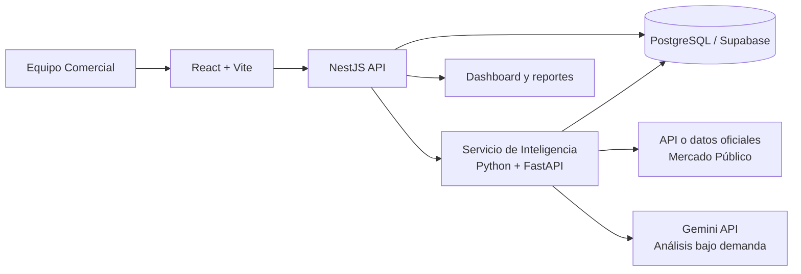
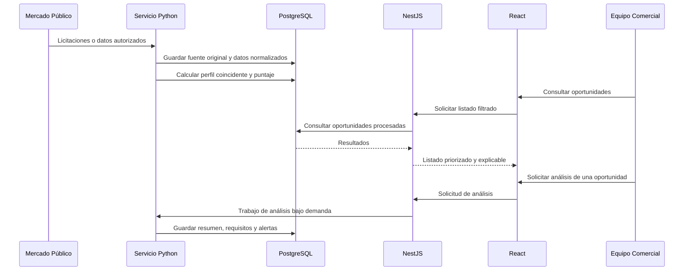

# LICING Asistente de MercadoPublico para Hotel San Francisco

> Asistente inteligente para la detección, filtrado, análisis y seguimiento de oportunidades de licitación en Mercado Público para el Hotel Plaza San Francisco.

## Descripción

LICING WEB es una plataforma de apoyo a la decisión comercial. Su propósito es reducir el tiempo que el equipo de eventos dedica a revisar manualmente oportunidades en Mercado Público y Compra Ágil.

La plataforma identifica licitaciones potencialmente relevantes para el hotel, las filtra según criterios configurables, las prioriza mediante un puntaje explicable y permite realizar seguimiento de cada oportunidad.

LICING no postula automáticamente ni toma decisiones comerciales. La decisión final de participar en una licitación permanece en manos del equipo comercial.

## Problema

El proceso actual de búsqueda manual presenta dificultades:

- Revisión diaria de numerosas páginas de resultados.
- Uso de términos diferentes para una misma necesidad, por ejemplo: `hospedaje`, `alojamiento`, `habitaciones` o `pernoctación`.
- Resultados no relevantes que generan ruido.
- Riesgo de perder oportunidades por detectarlas tarde.
- Posibles inconsistencias entre el resumen de una licitación, su identificador y sus documentos adjuntos.
- Tiempo elevado para leer bases técnicas y revisar documentos administrativos obligatorios.

## Objetivo general

Desarrollar una aplicación web que permita detectar, filtrar, analizar y priorizar oportunidades de Mercado Público relacionadas con alojamiento, eventos y catering para el Hotel Plaza San Francisco.

## Objetivos específicos

- Obtener y almacenar licitaciones desde fuentes oficiales autorizadas.
- Normalizar y mantener trazabilidad de los datos obtenidos.
- Implementar perfiles de búsqueda reutilizables para alojamiento y eventos/catering.
- Filtrar oportunidades por palabras clave, sinónimos, exclusiones, región, monto, tipo de proceso y fecha de cierre.
- Priorizar oportunidades mediante un puntaje explicable.
- Validar información de una oportunidad mediante la consulta de su detalle y documentos adjuntos.
- Analizar TDR o bases seleccionadas para extraer servicios, fechas, presupuesto y requisitos administrativos.
- Gestionar estados comerciales de las oportunidades.
- Visualizar métricas y el embudo comercial en un dashboard.

## Perfiles iniciales

| Perfil | Términos principales | Objetivo comercial |
|---|---|---|
| Alojamiento | Hospedaje, alojamiento, habitaciones, estadía, pernoctación, delegación | Detectar necesidades de hospedaje para funcionarios, delegaciones o actividades institucionales |
| Eventos y catering | Eventos, catering, banquetería, salón, centro de eventos, coffee break, alimentación | Detectar servicios de alimentación, reuniones, seminarios y uso de espacios |

Los perfiles podrán incorporar términos incluidos, términos excluidos, región, monto, días restantes para cierre y tipos de proceso.

## Alcance del MVP

La primera versión incluirá:

- Aplicación web accesible desde navegador.
- Autenticación básica y control de acceso.
- Ingesta de una muestra real o fuente oficial autorizada de licitaciones.
- Almacenamiento de datos originales y normalizados.
- Perfiles de búsqueda para alojamiento y eventos/catering.
- Filtros por términos, sinónimos, exclusiones, Región Metropolitana, monto y fecha de cierre.
- Priorización basada en reglas y puntajes explicables.
- Listado y detalle de oportunidades.
- Validación del identificador y consulta del detalle de la licitación.
- Estados comerciales:
  - Identificada
  - Calificada
  - Participada
  - Adjudicada
  - Descartada
- Dashboard inicial con métricas del embudo comercial.
- Análisis de documentos bajo demanda para oportunidades seleccionadas.
- Ejecución local reproducible con Docker.

## Fuera de alcance del MVP

- Postulación automática a licitaciones.
- Decisiones comerciales automáticas.
- Garantizar adjudicaciones.
- Entrenamiento de un modelo predictivo desde cero.
- Análisis masivo de todos los PDF disponibles.
- Reemplazar la revisión final del equipo comercial.
- Despliegue definitivo en un proveedor cloud antes de validar el flujo local.

## Arquitectura

LICING WEB separa la experiencia del usuario del procesamiento de datos e inteligencia artificial.


```mermaid
flowchart LR
    U[Equipo Comercial] --> FE[React + Vite]
    FE --> API[NestJS API]

    API --> DB[(PostgreSQL / Supabase)]
    API --> INT[Servicio de Inteligencia<br/>Python + FastAPI]

    INT --> MP[API o datos oficiales<br/>Mercado Público]
    INT --> DB
    INT --> LLM[Gemini API<br/>Análisis bajo demanda]

    API --> DASH[Dashboard y reportes]
```

### Flujo principal


```mermaid
sequenceDiagram
    participant MP as Mercado Público
    participant INT as Servicio Python
    participant DB as PostgreSQL
    participant API as NestJS
    participant UI as React
    participant USER as Equipo Comercial

    MP->>INT: Licitaciones o datos autorizados
    INT->>DB: Guardar fuente original y datos normalizados
    INT->>DB: Calcular perfil coincidente y puntaje
    USER->>UI: Consultar oportunidades
    UI->>API: Solicitar listado filtrado
    API->>DB: Consultar oportunidades procesadas
    DB-->>API: Resultados
    API-->>UI: Listado priorizado y explicable
    USER->>UI: Solicitar análisis de una oportunidad
    UI->>API: Solicitud de análisis
    API->>INT: Trabajo de análisis bajo demanda
    INT->>DB: Guardar resumen, requisitos y alertas
```

## Componentes

### Frontend

El frontend permite al equipo comercial:

- Consultar oportunidades detectadas.
- Aplicar filtros y seleccionar perfiles de búsqueda.
- Revisar el detalle de una licitación.
- Ver por qué una oportunidad recibió su puntaje.
- Cambiar el estado comercial de una oportunidad.
- Consultar indicadores y reportes.

### Backend

El backend administra:

- Usuarios y autorización.
- Perfiles de búsqueda.
- Oportunidades y estados comerciales.
- Filtros configurables.
- Dashboard y reportes.
- Comunicación entre frontend, base de datos y servicio inteligente.

### Servicio de inteligencia

El servicio en Python realiza:

- Ingesta de licitaciones desde fuentes autorizadas.
- Normalización y deduplicación de registros.
- Procesamiento tabular.
- Detección de coincidencias por términos, sinónimos y exclusiones.
- Cálculo de puntajes de relevancia.
- Análisis bajo demanda de bases y TDR.
- Extracción de servicios, fechas, presupuesto y requisitos administrativos.
- Integración opcional con Gemini API.

## Priorización inicial

El MVP no depende de un modelo de machine learning entrenado.

La prioridad se calculará con reglas configurables y explicables, por ejemplo:

- Coincidencia con términos obligatorios.
- Coincidencia con términos relacionados o sinónimos.
- Presencia de términos excluidos.
- Región Metropolitana o comuna prioritaria.
- Tipo de proceso, con prioridad para Compra Ágil.
- Monto disponible y umbral del perfil.
- Cercanía de la fecha de cierre.
- Validación correcta del identificador y sus adjuntos.

Cada resultado mostrará la razón de su clasificación, por ejemplo:

> Coincide con “alojamiento” y “delegación”, está ubicado en Santiago, cierra en 8 días y cumple el umbral de monto configurado.

## Evolución de IA y ML

El análisis semántico y documental se incorporará progresivamente.

### Primera etapa

- Diccionarios de términos y sinónimos.
- Reglas configurables.
- Puntajes transparentes.
- Gemini API para resumir documentos seleccionados y extraer información estructurada.

### Evolución futura

Cuando el equipo comercial registre suficientes decisiones reales, se podrán utilizar como etiquetas:

- Relevante.
- No relevante.
- Calificada.
- Participada.
- Adjudicada.
- Descartada.

Con esos datos será posible evaluar un modelo supervisado para mejorar la priorización. El modelo será una mejora del sistema, no un requisito para que el MVP funcione.

## Tecnologías

| Capa | Tecnología | Uso |
|---|---|---|
| Frontend | React + Vite + TypeScript | Interfaz web y dashboard |
| Backend | NestJS + TypeScript | API REST, usuarios, filtros, oportunidades y reportes |
| Servicio de datos e IA | Python + FastAPI | Ingesta, procesamiento, análisis semántico y TDR |
| Procesamiento de datos | Polars | Limpieza, transformación y análisis tabular |
| LLM | Google Gemini API | Resumen y extracción bajo demanda |
| Base de datos | PostgreSQL | Datos operacionales, análisis, estados y trazabilidad |
| Plataforma de datos | Supabase | PostgreSQL administrado, autenticación y servicios complementarios |
| Contenedores | Docker + Docker Compose | Entorno local reproducible |
| Control de versiones | Git + GitHub | Gestión de código y colaboración |
| CI/CD | GitHub Actions | Linting, pruebas y build de forma progresiva |
| Cloud | Por definir | Se decidirá según costos, seguridad y necesidades de despliegue |

## Estructura propuesta

```text
licing/
├── apps/
│   ├── web/                    # React + Vite
│   ├── api/                    # NestJS
│   └── intelligence/           # Python + FastAPI
├── packages/
│   ├── shared-types/           # Tipos y contratos compartidos
│   └── config/                 # Configuraciones comunes
├── docs/
│   ├── architecture.md
│   ├── requirements.md
│   ├── api.md
│   └── diagrams/
├── infrastructure/
│   ├── docker/
│   └── database/
├── tests/
│   ├── integration/
│   └── e2e/
├── .github/
│   └── workflows/
├── docker-compose.yml
├── .env.example
└── README.md
```

## Modelo de datos conceptual

Las áreas principales de información serán:

| Área | Ejemplos de información |
|---|---|
| Datos originales | Respuesta de API, fecha de extracción, identificador externo, JSON original |
| Licitación normalizada | Título, organismo, región, monto, fecha de cierre, estado, enlaces y adjuntos |
| Perfiles de búsqueda | Términos incluidos, excluidos, región, monto y umbrales |
| Evaluación | Perfil coincidente, puntaje, razones de coincidencia, fecha de análisis |
| Análisis documental | Resumen, presupuesto, fechas, servicios, requisitos y documentos obligatorios |
| Gestión comercial | Estado, notas, responsable y fechas de seguimiento |
| Auditoría | Ejecuciones, errores, cambios de estado y trazabilidad |

## Metodología de trabajo

El proyecto se desarrollará con Scrum liviano y sprints de dos semanas.

### Roles

- **Product Owner:** representante del Hotel Plaza San Francisco que prioriza necesidades y valida los resultados.
- **Equipo de desarrollo:** implementa frontend, backend, procesamiento de datos, integración y pruebas.
- **Scrum Master:** facilita el trabajo, identifica bloqueos y vela por el cumplimiento del objetivo del sprint.

### Ceremonias

- Planificación de sprint.
- Reunión diaria breve del equipo.
- Revisión de sprint con el hotel.
- Retrospectiva interna.
- Refinamiento periódico del Product Backlog.

### Artefactos

- Product Backlog.
- Sprint Backlog.
- Historias de usuario.
- Criterios de aceptación.
- Tablero de tareas en GitHub Projects.
- Incremento funcional al cierre de cada sprint.

## Plan de sprints

| Sprint | Objetivo | Entregable |
|---|---|---|
| Sprint 1 | Preparar base técnica | Repositorio, Docker Compose, PostgreSQL/Supabase, estructura inicial y datos de prueba |
| Sprint 2 | Obtener y normalizar datos | Ingesta, almacenamiento original, normalización, deduplicación y trazabilidad |
| Sprint 3 | Construir filtros de negocio | Perfiles Alojamiento y Eventos/Catering, filtros, exclusiones y puntajes |
| Sprint 4 | Mostrar resultados en la web | Listado, detalle, explicación de puntaje y estados comerciales |
| Sprint 5 | Validar y analizar oportunidades | Validación de ID, adjuntos y análisis documental bajo demanda |
| Sprint 6 | Consolidar el MVP | Dashboard, pruebas, documentación, correcciones y demostración |

## Ejemplo de historia de usuario

```text
Como integrante del equipo de eventos,
quiero seleccionar el perfil “Alojamiento”
para visualizar licitaciones relevantes en la Región Metropolitana
y priorizar rápidamente las oportunidades que el hotel podría atender.
```

### Criterios de aceptación

- El usuario puede seleccionar el perfil Alojamiento.
- El sistema muestra oportunidades vigentes.
- Los resultados incluyen título, organismo, monto, región y fecha de cierre.
- El sistema muestra un puntaje de relevancia.
- El sistema explica los términos y reglas que generaron la coincidencia.
- El usuario puede cambiar el estado comercial de la oportunidad.

## Seguridad

La solución considerará:

- Autenticación de usuarios.
- Autorización basada en roles.
- Validación de datos de entrada.
- Protección de endpoints.
- Variables de entorno para credenciales y claves.
- No publicar secretos en Git.
- Separación entre ambientes local, pruebas y producción.
- Principio de mínimo privilegio.
- Registro de errores y operaciones relevantes.
- Uso exclusivo de mecanismos oficiales y autorizados para integrarse con Mercado Público.

## Calidad y pruebas

Se incorporarán de forma progresiva:

- Pruebas unitarias para normalización, filtros y cálculo de puntajes.
- Pruebas de integración para API, base de datos e ingesta.
- Pruebas end-to-end para flujos críticos de usuario.
- Validación manual con oportunidades reales.
- Revisión del equipo comercial sobre relevancia de resultados.
- Evaluación de resultados de IA antes de mostrarlos como información definitiva.

## Ejecución local

> Los comandos concretos se incorporarán al crear los proyectos iniciales.

Requisitos previstos:

- Node.js LTS.
- Python 3.11 o superior.
- Docker Desktop.
- Git.
- Cuenta de Supabase o PostgreSQL local.
- Credenciales autorizadas para las integraciones externas necesarias.

Flujo esperado:

```bash
git clone <URL_DEL_REPOSITORIO>
cd licing
cp .env.example .env
docker compose up --build
```

## Estado del proyecto

Proyecto en etapa de definición y construcción del MVP.

Las decisiones de infraestructura cloud pueden evolucionar según costos, validación técnica, seguridad y retroalimentación del Hotel Plaza San Francisco.
